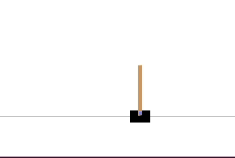
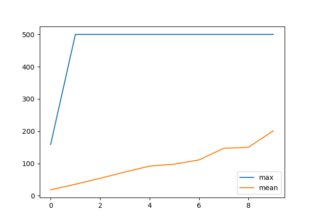
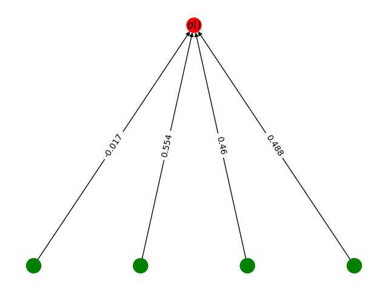
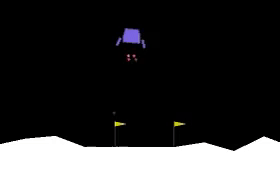
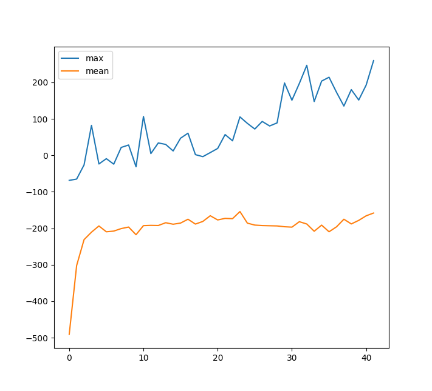
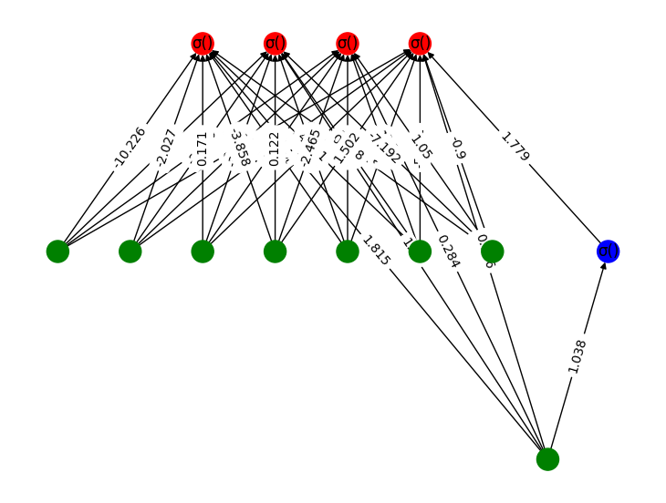

# pyneat

This is an implementation of **NEAT: NeuroEvolution of Augmenting Topologies** in Python.

 Environments | Plot (reward vs. generations) | Evolved Neural Network Architecture
:---: | :---: | :---:
 |  | 
 |  | 

## Installation

```bash
pip install numpy scipy matplotlib
conda install pygraphviz
pip install networkx
```

Installation of OpenAI Gym: [[link](https://github.com/openai/gym)]

## How to use?

This is a minimal implementation of NEAT. I haven't used any sort of parallel computing tricks like ``multiprocessing`` over here. The implementation should be fairly easy to understand.

```bash
python run_neat.py --help

python run_neat.py --task=lunar   # Run NEAT to learn lunar-lander policy
```

For any customization:
* Different tasks: Edit ``run_neat.py``  
* Hyperparameters: Edit ``pyneat/config.py``

## References:
* Stanley, Kenneth O., and Risto Miikkulainen. "Efficient evolution of neural network topologies." Proceedings of the 2002 Congress on Evolutionary Computation. CEC'02 (Cat. No. 02TH8600). Vol. 2. IEEE, 2002.
* **neat-python**: [https://github.com/CodeReclaimers/neat-python](https://github.com/CodeReclaimers/neat-python)

Refer the following implementation for additional (advanced) functionalities.
* [https://github.com/google/brain-tokyo-workshop/tree/master/WANNRelease/prettyNEAT](https://github.com/google/brain-tokyo-workshop/tree/master/WANNRelease/prettyNEAT) 
* [MultiNEAT](https://github.com/peter-ch/MultiNEAT)
* [pureples](https://github.com/ukuleleplayer/pureples)

**Please let me know if you come across any bugs in this implementation. Feel free to send any pull requests.**
